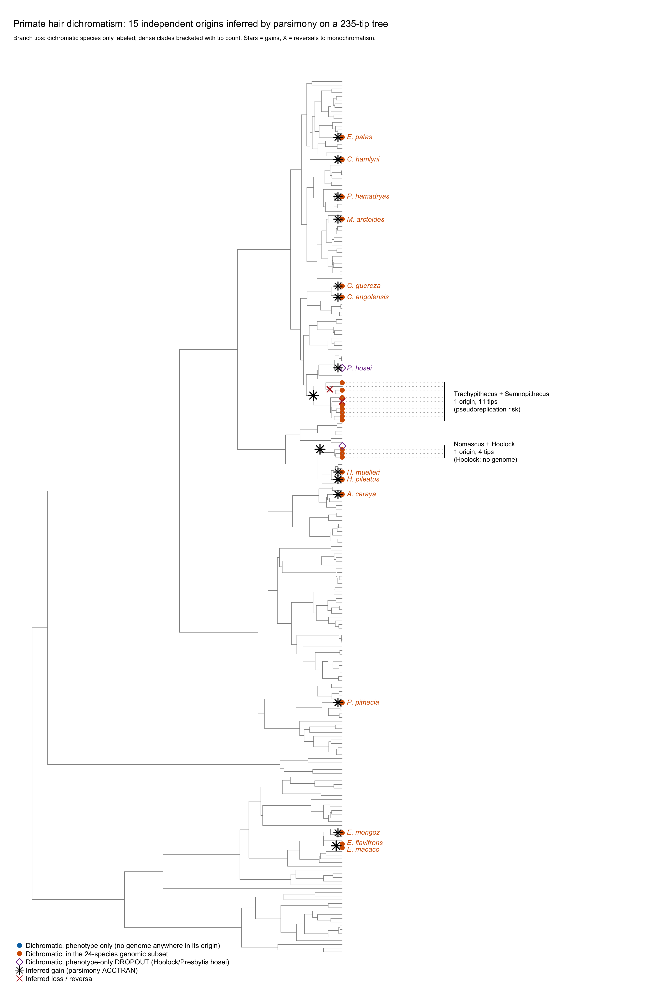
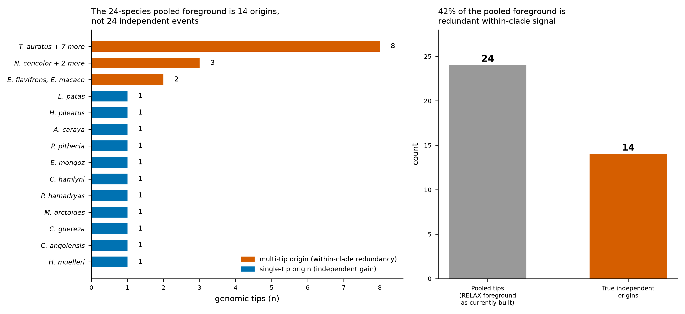
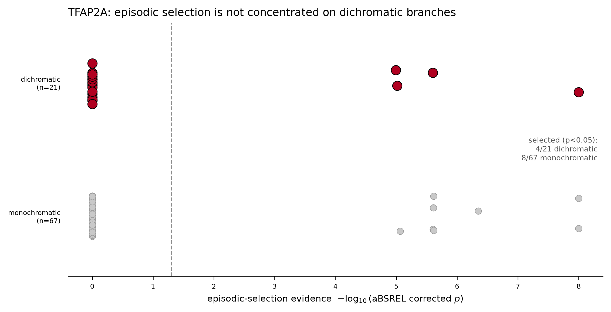

::: {.callout-note}
## Terms used on this page, in plain language
So this page stands on its own — you should not need a genetics background to follow it.

- **Sexual dichromatism** — the males and females of a species differ in color (here, in hair color).
- **Independent origin** — a separate evolutionary appearance of the trait. If two species are both
  dichromatic but their shared ancestor was not, dichromatism arose *twice*, not once. Counting
  origins (rather than counting dichromatic species) is the central move on this page.
- **Polygenic** — built by many genes acting together, rather than switched on or off by one gene.
- **Labile** — evolutionarily unstable: readily gained *and* readily lost over time.
- **Ancestral-state reconstruction** — working backward from the living species to infer whether
  each ancestor on the family tree had the trait, which is how we locate where it was gained or lost.
- **dN/dS (ω)** — a number that measures the kind of natural selection acting on a gene's protein.
  ω ≈ 1 means no net selection, ω < 1 means the protein is being conserved, ω > 1 means it is being
  actively changed (positive selection). "Episodic" selection means ω spikes above 1 on particular
  branches of the tree rather than everywhere.
- **RELAX, aBSREL, RERconverge** — three standard statistical tests (from the HyPhy and RERconverge
  toolkits) that each ask, in a different way, whether specific genes evolved faster on the branches
  where dichromatism arose. Using three lets us cover origins with different amounts of data.
:::

## Point the network at evolution

The rest of this project builds a curated pigmentation gene network and uses it to grade *human*
genotype→phenotype claims. This page asks a different question with the **same object**: *what
does a pigmentation-network approach reveal when you point it at evolutionary genomics instead of
human association?* The answer is the finding below — and it only becomes visible **because** we
treat the genes as a coupled network rather than a flat candidate list.

Two things fall out of the network framing that a single-gene scan would miss:

- **The pigmentation and sex-hormone networks are not independent lists — they are physically
  coupled.** The clearest bridge is **POMC**: the same pro-hormone is cleaved into α-MSH, which
  drives pigmentation through the melanocortin receptor, **and** ACTH, which drives the adrenal
  steroid axis. A gene sitting on both networks is exactly where a sexually dimorphic,
  hormone-linked color trait would be expected to act. (POMC's *own* selection signal doesn't
  survive our alignment QC in this run — a truncated extraction, flagged not interpreted — which
  is precisely the kind of gene a denser genome set would let us re-test.)
- **Selection localizes to modules, and modules to branches.** The signal that passes the
  significance and alignment-QC gate is not
  scattered noise: on the pigmentation side it concentrates in the melanoblast-development module
  (KITLG–EDN3–TFAP2A); on the hormone side in steroid-metabolism enzymes (HSD17B1/12/7, SRD5A1,
  CYP7B1) — not the receptors. The open question the per-origin design tests directly is whether
  **the pigmentation module is remodeled in some origins while the hormone module is remodeled in
  others** — i.e. different lineages reach the same phenotype through different parts of the
  coupled network.

That second point is the evolutionary-genomics insight the network approach yields: dichromatism
looks less like "a gene" and more like *a coupled pigmentation–hormone system with several
accessible failure/remodeling points*, which is why it can be gained and lost so readily.

## The one-sentence result

In birds, the best-studied cases of sexual dichromatism map to **genes of major effect** for a
specific pigment system in a specific clade: *MC1R* for melanin-based dichromatism in galliforms
([Nadeau et al. 2007](https://doi.org/10.1098/rspb.2007.0174) report a dN/dS–dichromatism
correlation at that one locus), and *BCO2* for carotenoid-based dichromatism in finches
([Gazda et al. 2020, *Science*](https://doi.org/10.1126/science.aba0803)) — and these are
hormonally regulated (there is an active estrogen/testosterone-control literature in birds,
[Griffith et al. 2026, *Integr Comp Biol*](https://doi.org/10.1093/icb/icag079)). **In primates it is
not.** Hair dichromatism has arisen **~15 times independently** across the primate radiation and
is **polygenic in every origin** (and *MC1R* is not the hit). The trait is also evolutionarily
labile, lost roughly **9× more readily than it is gained**, consistent with dichromatism being
reachable through several alternative genetic routes rather than one canonical switch. (We tested
the coupling directly: the **pigmentation and sex-hormone modules co-evolve with each other** —
concordant per-lineage selection, PGLS β ≈ 0.42, *p* ≈ 1e-4 — but that coupled selection **does not
track the trait**: a phylogenetic correlated-evolution test prefers the model in which module
selection and dichromatism evolve independently. The network is coupled to itself, not to the
phenotype.) Whether the *same* or *different* parts of that network are recruited across origins — a
shared versus heterogeneous architecture — is **not yet resolvable with the current data**: only 3
origins are powered for the selection test, and a homogeneity test across the 11 origins with any
detectable selection does not reject a single shared architecture (χ² p = 0.42). We therefore
report the polygenic, labile, non-*MC1R* result as the finding, and leave shared-vs-heterogeneous
as an explicitly open question (see *Limitations*).

::: {.callout-note}
## Why this is novel
This is the first clade-wide, multi-gene, selection-inference test of the genomic basis of
sexual dichromatism in primates. Prior primate work is single-gene (MC1R) and framed as coat
color, not sexual dichromatism; no published study or 2023–2026 preprint tests it as a
network-level, per-origin question. The contribution is a **shift in the unit of analysis** —
from "dichromatic species" to "independent origin of dichromatism" — and the finding that the
trait is polygenic and non-*MC1R* in every origin tested. (Whether the architecture is *shared*
or *heterogeneous* across origins is set up by this design but is not yet powered to resolve; see
*Limitations*.)
:::

## Dichromatism is not one event — it is ~15

Sexual dichromatism is not a single event to be pooled across species: pooling every dichromatic
species into one foreground and asking "does selection intensify in dichromatic lineages"
presupposes a shared, convergent architecture — the very thing in question. Reconstructing the
trait's history from the raw 238-species trait table and tree, by ancestral-state reconstruction,
shows why the independent origin, not the species, is the right unit:

The 24 genomically-sampled dichromatic species collapse to only **14 independent origins**
(≈15 across the full tree; one, *Presbytis hosei*, has no genome). Of the 14:

- **11 are single genomic tips** — each a genuinely separate evolutionary gain.
- **3 are multi-tip radiations** descended from one ancestral gain each: *Trachypithecus* (8
  tips), *Nomascus* (3), *Eulemur macaco/flavifrons* (2).

So **10 of the 24 pooled tips (42%) are within-clade replicates of just 3 events**, and
*Trachypithecus* alone carried a third of the foreground weight. A pooled test reporting *n* = 24
was effectively an *n* = 14 analysis dominated by one clade.

## Selection is scattered, not concentrated

With aBSREL fitting a dN/dS to every branch, the pattern on *TFAP2A* — one of the pooled
"certified" pigmentation hits — is telling: episodic selection appears on **4 of 21 dichromatic
tips and 8 of 67 monochromatic tips**. It is scattered across the tree, not concentrated on
dichromatic lineages. *TFAP2A* is a widely re-used gene under episodic selection in many
primates; being dichromatic does not predict selection on it.

::: {.column-margin}
Compare Nadeau et al. (2007), Fig. 1 — the same tree-with-dN/dS-and-dichromatism layout for
galliform birds, where the signal *does* track the dichromatic clades because it is essentially
one gene.
:::

The companion strip plot below separates the same result by dichromatic vs. monochromatic status,
on a −log₁₀(corrected p) axis:

::: {.callout-tip appearance="simple"}
Two branches showed an *undefined* ω from near-zero synonymous change (*Macaca tonkeana*,
*Mandrillus sphinx*) — flagged as artifacts, **not** read as extreme positive selection. This is
the standard aBSREL failure mode: infinite ω on a branch with dS ≈ 0 is undefined, not signal.
:::

## The three-layer test, matched to the origin structure

Because only 3 origins have ≥2 tips, no single method covers all of them. The design uses three
selection layers, each matched to what the data can support. The unifying question each layer
asks is the coupled-network one: **for a given origin, is it the pigmentation module or the
hormone module that carries the selection signal** — and does that differ from origin to origin?

| Layer | Method | Covers | Question |
|---|---|---|---|
| Per-origin | HyPhy **RELAX** | the 3 multi-tip origins | for *Trachypithecus*, *Nomascus*, *Eulemur* — is the intensified module the pigmentation axis, the hormone axis, or both, and is it the **same** module across origins (convergence) or **different** (heterogeneous, branch-specific)? |
| Per-branch | HyPhy **aBSREL** | all 14 origins (each single-tip origin = one branch) | which individual lineages carry episodic selection, at which genes? |
| Relative-rate | **RERconverge** | all origins at once | across the tree, do the origins accelerate the same genes — no per-origin foreground needed? |

## The cross-taxon contrast

| | birds | primates |
|---|---|---|
| genetic basis | genes of major effect, clade- and pigment-specific — *MC1R*/melanin in galliforms (Nadeau 2007), *BCO2*/carotenoid in finches (Gazda 2020) | polygenic; no single gene of major effect (*MC1R* is **not** the hit) |
| pigmentation signal sits at | a named large-effect locus per clade | melanoblast development / signaling (KITLG–EDN3–TFAP2A) — no single dominant node |
| architecture across origins | not systematically tested clade-wide | polygenic; shared-vs-heterogeneous **underpowered to resolve** (χ² p = 0.42) |
| hormone coupling | present — dichromatism genes hormonally regulated (Griffith et al. 2026) | the two modules co-evolve with each other (concordant selection, tested) but that coupling does not track the trait (correlated-evolution test: independent model preferred) |
| trait stability | — | labile; loss ≈ 9× faster than gain |

## Limitations

- Per-origin RELAX is statistically powered only for the 3 multi-tip origins; the 11 single-tip
  origins are testable via aBSREL (per branch) and RERconverge (relative rates). All three are
  reported; single-tip origins are not treated as missing data.
- One phenotypic origin (*Presbytis hosei*) has no genome; a targeted genome-expansion round adds
  a *Presbytis* proxy and recovers the *Hoolock* origin at genus level.
- The pigmentation-vs-hormone **set-level** contrast is not significant (permutation *p* ≈ 0.87)
  and is **not** claimed. The apparent hormone-tilt in the pooled selected set (≈59% hormone) is
  consistent with the panel's own 2:1 hormone:pigmentation gene ratio (binomial *p* ≈ 0.17), not
  with preferential selection on either module.
- **A phylogeny-controlled cross-species association scan finds one suggestive gene.** Treating the
  origins as a cross-species GWAS — dichromatic/monochromatic as case/control, per-lineage dN/dS as
  the per-gene marker, and phylogenetic covariance (per-gene Pagel's λ) as the stratification
  control — one gene survives multiple-testing correction: *AKR1C4*, a sex-hormone-module steroid
  reductase, with elevated dN/dS on dichromatic lineages (BH *p* ≈ 0.04, confirmed by a
  tree-structured permutation test, *p* ≈ 5e-4). This is a **single suggestive candidate**, not an
  established locus: one hit among ~80 genes with only ~24 cases, and the binding constraint is the
  number of independent dichromatic lineages, which no method can inflate. See
  `notebooks/16_cross_species_gwas.ipynb`.
- **Shared vs. heterogeneous architecture is currently underpowered to resolve.** A χ² homogeneity
  test across the 11 origins with any detectable selection does not reject a single shared
  architecture (*p* ≈ 0.42; Monte-Carlo *p* ≈ 0.45), and the two "pure-module" poles (*Eulemur*,
  *Pithecia*) are each defined by only 1–2 selected genes — a small-sample funnel effect, not a
  measured contrast. Gene count per origin is ≈92% explained by foreground-tip count. The
  established finding is that the trait is **polygenic and non-*MC1R***; "different genes in
  different lineages" is a hypothesis this data cannot yet confirm or reject. A rank-based
  cross-lineage test (e.g. PicMin) on the 14 origins, and a network-subgraph test (e.g. signet),
  are the powered next steps — see `internal/lit_review/phylo-grn/`.

## Reproducibility

The full pipeline (miniprot → MAFFT → RELAX / aBSREL / RERconverge), the 14-origin foreground map,
the two-round genome-expansion roster, and the exact cluster run protocol are in
[`comparative-genomics/`](https://github.com/tinalasisi/pigmentation-gene-network/tree/main/comparative-genomics)
and the handoff notes under `internal/handoffs/notes/`. The selection run executes on the
University of Michigan Great Lakes cluster; only small summary tables are committed and pasted
back — genomes and alignments stay on scratch.
